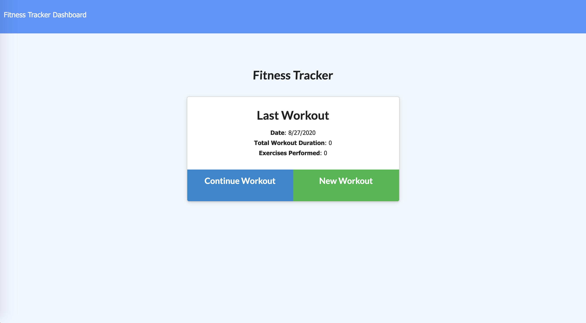
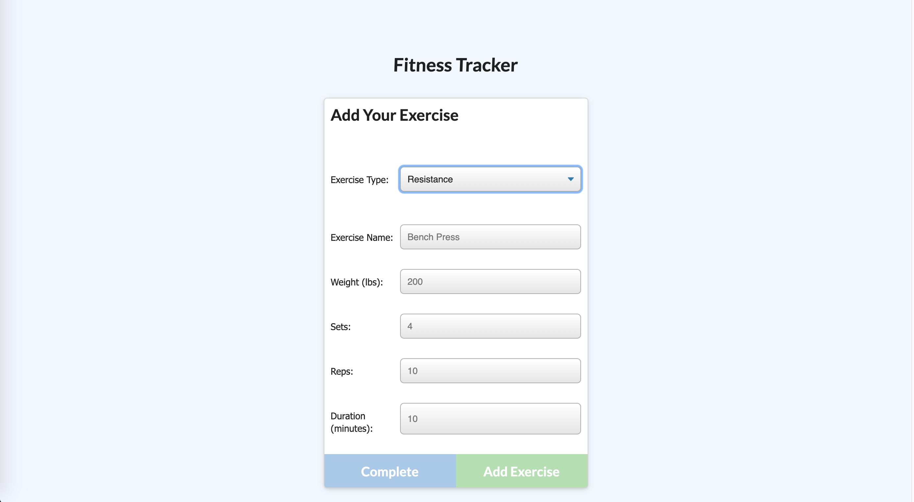
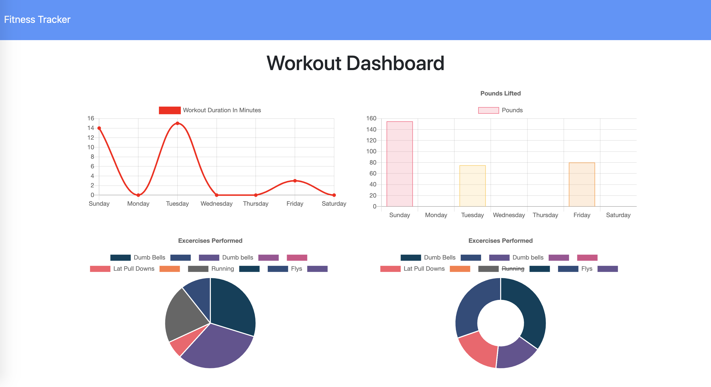

## Fitness-Tracker

## Description 

This application allows users to keep track of their workout. The users are also provided with a dashboard that contains charts and graphs to help them visualize their progress. 

The users are first prompted to enter all the requiered workout information. They can track the name, type, weight, sets, reps, and duration of exercise. Once complete, they will then be provided with a summarization of their workout. The user also has the option to add an exercise to an existing workout plan they already have running.

## Pseudo Code

This application is built on a Mongo database with a Mongoose schema while Express handles the routing. The public folder is home to all the front end html files that are stored with their supporting JS and CSS files, this provides all the user interaction. 

The workout.js folder in the models folder contains the inputs for the user along with the mongoose schema that is exported as "Workout". "Workout" is then routed to the backend through the api-routes.js file. The seed.js file is home to the mongo database and everything is tied together and delievered in the server.js file. 

To run the application on a localhost, the user simply has to run "node server". 

## Technologies

* HTML
* CSS 
* Javascript
* Mongo DB
* Mongoose
* Express

## Links

Github Repo: https://github.com/elock721/Fitness-Tracker

Heroku Deployment:  https://polar-waters-24843.herokuapp.com/?id=5f2cd0316e8cbd001767a7e5

## Screenshots

